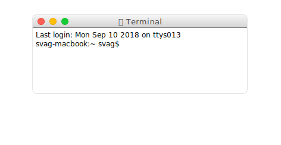
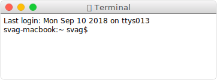

# @svag/window

[](https://npmjs.org/package/@svag/window)

`@svag/window` is a simple window with a shadow and toolbar.

```sh
yarn add -E @svag/window
```

## Table Of Contents

- [Table Of Contents](#table-of-contents)
- [API](#api)
  * [`window(options: WindowOptions): string`](#windowoptions-windowoptions-string)
    * [`WindowOptions`](#windowoptions)
    * [without a shadow](#without-a-shadow)
- [TODO](#todo)
- [Copyright](#copyright)

## API

The package is available by importing its default function:

```js
import Window from '@svag/window'
```

### `window(`<br/>&nbsp;&nbsp;`options: WindowOptions,`<br/>`): string`

Creates a complete `SVG` representing a macOS window.

__<a name="windowoptions">`WindowOptions`</a>__

| Name | Type | Description | Default |
| ---- | ---- | ----------- | ------- |
| __content*__ | _string_ | The content to display inside of the window. | - |
| __width*__ | _number_ | The width of the content. | - |
| __height*__ | _number_ | The height of the content. | - |
| backgroundColor | _string_ | The color of the window. | `#000000` |
| foregroundColor | _string_ | The foreground color of the container group which will hold the content. | `#FFFFFF` |
| noStretch | _boolean_ | Do not stretch the SVG when embedded as an image. This is achieved by explicitly setting width and height attributes on the `svg` element. | `false` |
| title | _string_ | An optional title for the window. | - |
| attributes | _object_ | Any additional attributes to set on the holder of the content, e.g., `font-family`. | - |
| minWidth | _number_ | The minimum width that the window should take. If the content's width is greater than this value, the height will adjust to the content. | - |
| minHeight | _number_ | The minimum height that the window should take. If the content's height is greater than this value, the height will adjust to the content. | - |
| paddingY | _number_ | The padding on the Y-axis (top and bottom). | `5` |
| paddingX | _number_ | The padding on the X-axis (left and right). | `5` |
| noShadow | _boolean_ | Disable the dropping shadow. | `false` |
| minify | _boolean_ | Remove whitespace between tags (e.g., between `>` and `<`). If there are any problems with generated SVG, this could be disabled. | `true` |

```js
import { makeElement } from '@svag/lib'
import Window from '@svag/window'

const content = makeElement({
  name: 'text',
  attributes: {
    'font-family': 'Monaco, Courier',
    'font-size': '12px',
    x: 0,
    y: 10,
  },
  content: `Last login: ${new Date().toDateString()} on ttys013`,
})
const content2 = makeElement({
  name: 'text',
  attributes: {
    'font-family': 'Monaco, Courier',
    'font-size': '12px',
    x: 0,
    y: 25,
  },
  content: 'svag-macbook:~ svag$ ',
})

const res = Window({
  title: '🚞 Terminal',
  width: 350,
  height: 100,
  noStretch: true,
  content: [content, content2].join('\n'),
  minify: false,
})
```

```svg
<?xml version="1.0" encoding="utf-8"?>
<svg version="1.1" xmlns="http://www.w3.org/2000/svg" xmlns:xlink="http://www.w3.org/1999/xlink" viewBox="0, 0, 472, 244" width="472px" height="244px">
<g transform="translate(55, 25)" filter="url(#shadow)" fill="none"><defs>
  <filter x="-16%" y="-19%" width="132%" height="180%" id="shadow">
    <feOffset dx="0" dy="25" in="SourceAlpha" result="so"/>
    <feGaussianBlur stdDeviation="27.5" in="so" result="sb"/>
    <feColorMatrix values="0 0 0 0 0   0 0 0 0 0   0 0 0 0 0  0 0 0 0.5 0" type="matrix" in="sb" result="sm"/>
    <feMerge>
      <feMergeNode in="sm"/>
      <feMergeNode in="SourceGraphic"/>
    </feMerge>
  </filter>
</defs>
<rect height="132" width="360" rx="6" stroke="#000000" stroke-opacity="0.2"/>
<defs><linearGradient x1="50%" y1="0%" x2="50%" y2="100%" id="toolbar">
  <stop stop-color="#FFFFFF" offset="0%"/>
  <stop stop-color="#F5F4F5" offset="5%"/>
  <stop stop-color="#D3D3D3" offset="100%"/>
</linearGradient></defs>
<path d="M6,0 L354,0 C 357 0, 360 3, 360 6 L360,22 L0,22 L0,16 L0,6 C 0 3, 3 0, 6 0" fill="url(#toolbar)"/>
<text x="180" y="16" font-family="HelveticaNeue, Helvetica Neue" font-size="13" letter-spacing="0.4" fill="#464646" text-anchor="middle">🚞 Terminal</text>
<g transform="translate(9, 6)">
  <g>
    <circle stroke="#E33E32" stroke-width="1" cx="5" cy="5" r="5.5"/>
    <circle fill="#FF5F52" cx="5" cy="5" r="5.25"/>
  </g>
  <g>
    <circle stroke="#E2A100" stroke-width="1" cx="25" cy="5" r="5.5"/>
    <circle fill="#FFBE05" cx="25" cy="5" r="5.25"/>
  </g>
  <g>
    <circle stroke="#17B230" stroke-width="1" cx="45" cy="5" r="5.5"/>
    <circle fill="#15CC35" cx="45" cy="5" r="5.25"/>
  </g>
</g>
<path d="M360,22 L360,126 C 360 129, 357 132, 354 132 L6,132 C 3 132, 0 129, 0 126 L0,22 Z" fill="#FFFFFF"/>
<line x1="0" y1="22.5" x2="360" y2="22.5" stroke="#7E7E7E" shape-rendering="crispEdges"/>
<g transform="translate(5, 28)" fill="#000000"><text font-family="Monaco, Courier" font-size="12px" x="0" y="10">Last login: Sat Sep 08 2018 on ttys013</text>
<text font-family="Monaco, Courier" font-size="12px" x="0" y="25">svag-macbook:~ svag$ </text></g></g></svg>
```



To generate a window <a name="without-a-shadow">without a shadow</a>, the `noShadow` option can be set. When `minify` attribute is not set to `false`, the whitespace will be removed.

```js
import { makeElement } from '@svag/lib'
import Window from '@svag/window'

const content = makeElement({
  name: 'text',
  attributes: {
    'font-family': 'Monaco, Courier',
    'font-size': '12px',
    x: 0,
    y: 10,
  },
  content: `Last login: ${new Date().toDateString()} on ttys013`,
})
const content2 = makeElement({
  name: 'text',
  attributes: {
    'font-family': 'Monaco, Courier',
    'font-size': '12px',
    x: 0,
    y: 25,
  },
  content: 'svag-macbook:~ svag$ ',
})

const res = Window({
  title: '🚞 Terminal',
  width: 350,
  height: 100,
  noStretch: true,
  content: [content, content2].join('\n'),
  noShadow: true,
})
```

```svg
<?xml version="1.0" encoding="utf-8"?><svg version="1.1" xmlns="http://www.w3.org/2000/svg" xmlns:xlink="http://www.w3.org/1999/xlink" viewBox="0, 0, 362, 134" width="362px" height="134px"><g transform="translate(1, 1)" fill="none"><rect height="132" width="360" rx="6" stroke="#000000" stroke-opacity="0.2"/><defs><linearGradient x1="50%" y1="0%" x2="50%" y2="100%" id="toolbar"><stop stop-color="#FFFFFF" offset="0%"/><stop stop-color="#F5F4F5" offset="5%"/><stop stop-color="#D3D3D3" offset="100%"/></linearGradient></defs><path d="M6,0 L354,0 C 357 0, 360 3, 360 6 L360,22 L0,22 L0,16 L0,6 C 0 3, 3 0, 6 0" fill="url(#toolbar)"/><text x="180" y="16" font-family="HelveticaNeue, Helvetica Neue" font-size="13" letter-spacing="0.4" fill="#464646" text-anchor="middle">🚞 Terminal</text><g transform="translate(9, 6)"><g><circle stroke="#E33E32" stroke-width="1" cx="5" cy="5" r="5.5"/><circle fill="#FF5F52" cx="5" cy="5" r="5.25"/></g><g><circle stroke="#E2A100" stroke-width="1" cx="25" cy="5" r="5.5"/><circle fill="#FFBE05" cx="25" cy="5" r="5.25"/></g><g><circle stroke="#17B230" stroke-width="1" cx="45" cy="5" r="5.5"/><circle fill="#15CC35" cx="45" cy="5" r="5.25"/></g></g><path d="M360,22 L360,126 C 360 129, 357 132, 354 132 L6,132 C 3 132, 0 129, 0 126 L0,22 Z" fill="#FFFFFF"/><line x1="0" y1="22.5" x2="360" y2="22.5" stroke="#7E7E7E" shape-rendering="crispEdges"/><g transform="translate(5, 28)" fill="#000000"><text font-family="Monaco, Courier" font-size="12px" x="0" y="10">Last login: Sat Sep 08 2018 on ttys013</text><text font-family="Monaco, Courier" font-size="12px" x="0" y="25">svag-macbook:~ svag$ </text></g></g></svg>
```



## TODO

- [ ] Add cursor to the preview.

## Copyright

(c) [SVaG][1] 2018

[1]: https://svag.co
